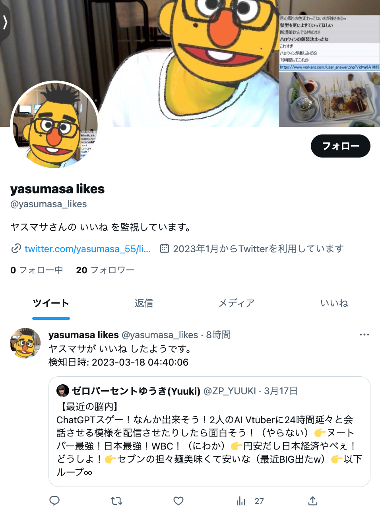

# yasumasa-likes

monitor and tweet the tweets that yasumasa has liked.



## setup

```shell
# launch docker
docker-compose up -d

# build
npm run build

# configure
cp .env.sample .env
vi .env

# run
node ./dist/index.js
```

## redis cheatsheet

```shell
# login to redis
docker exec -it [CONTAINER ID] /bin/bash
redis-cli

# list keys
keys *

# delete
del liked_tweet_ids

# list
smembers liked_tweet_ids
sismember liked_tweet_ids xxx

# add, remove
sadd liked_tweet_ids xxx
srem liked_tweet_ids xxx
```